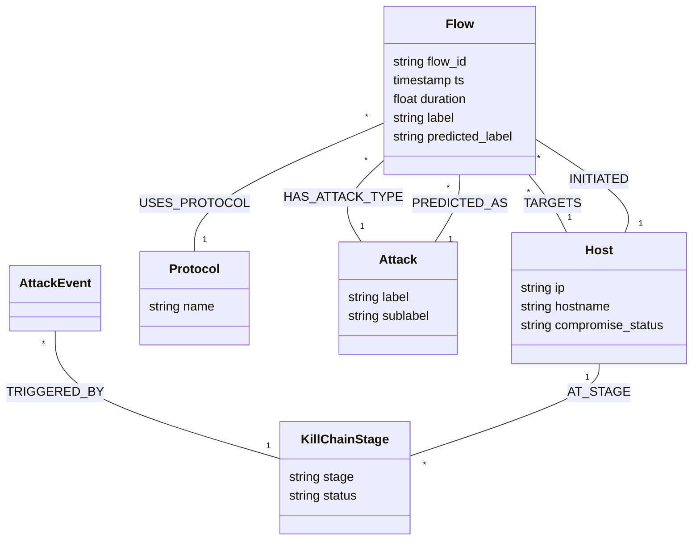

# ChainBreaker 🛡️

**Graph-driven Cyber Incident Detection and Automated Kill Chain Interruption Platform.**

ChainBreaker leverages the clinical precision of graph modeling to map network flows, identify multi-stage attack patterns (kill chains), and orchestrate automated defensive responses. By representing network telemetry as a persistent, queryable graph, ChainBreaker moves beyond simple alert triggers to provide deep contextual awareness of lateral movement and persistent threats.

## 🕸️ Graph-Driven Defense

At the heart of ChainBreaker is a **Flow-Centric Graph Model** powered by Neo4j. Unlike traditional log analysis, our graph architecture maintains the state of every host and communication channel, allowing the system to "remember" previous suspicious behaviors and link them to current events.

### The Flow-Centric Model
Most network security tools treat flows as isolated events. ChainBreaker transforms every `Flow` into a first-class citizen in the graph, connecting it to source/destination `Hosts`, the `Protocol` used, and potentially an `Attack` classification. This allows for:
- **Blast Radius Analysis**: Instantly identify which high-value assets are reachable from a compromised host.
- **Kill Chain Tracking**: Visualize the progression of an attack from initial access to data exfiltration.
- **Automated Containment**: Response agents can query the graph to determine the most effective isolation point.

### Graph Schema



#### Core Entities
- **Flow**: The central node representing a network communication event. Contains features exported from CICFlowMeter.
- **Host**: Represents an endpoint (IP). Tracks security status and roles.
- **Protocol**: Categorizes flows by protocol (TCP, UDP, ICMP, etc.).
- **Attack**: Categorical labels for known attack types (DDoS, Brute Force, etc.).
- **KillChainStage**: High-level stages (Reconnaissance, Exploitation, etc.) mapped to specific hosts.

## 🚀 Quick Start

### 1. Environment Setup
```bash
# Clone the repository
git clone https://github.com/your-org/ChainBreaker.git
cd ChainBreaker

# Setup virtual environment
python -m venv venv
source venv/bin/activate  # Windows: venv\Scripts\activate

# Install dependencies
pip install -r requirements.txt
```

### 2. Infrastructure
Ensure Docker is running, then start the stack:
```bash
# Starts Kafka, Zookeeper, and Neo4j
docker compose -f docker/docker-compose.yml up -d
```

### 3. Initialize Graph & Run
```bash
# 1. Initialize Neo4j schema and seed initial host data
# Use --dataset to seed from captured traffic, or it will create samples
python scripts/init_neo4j.py --dataset data/sample/phase1_NetworkData.csv

# 2. Start the Backend API
uvicorn backend.main:app --reload --port 8000

# 3. Start the Frontend Dashboard
cd frontend && npm install && npm run dev
```

## 📂 Project Structure

- `backend/graph/`: Neo4j driver, schema management, and Cypher queries.
- `backend/ingestion/`: Kafka consumers and network flow parsers.
- `backend/ml/`: Attack detection and RL-based response models.
- `docker/neo4j_setup/`: Cypher initialization scripts and constraints.
- `scripts/`:
  - `init_neo4j.py`: Schema setup and host/asset seeding.
  - `train_ml.py`: Classification model training.
  - `offline_processor.py`: Batch processing for ML datasets.
- `data/`: Raw and sample network datasets.
- `dev/`: Workspace for experimentation and research.

## 🤝 Contributing

1. **Feature Branches**: Create a new branch for each feature or bugfix.
2. **Environment**: Copy `.env.example` to `.env` and configure your credentials.
3. **Data**: Use `data/sample/` for local development and testing.

## 🛠️ Tech Stack
- **Engine**: Python 3.10+
- **Graph**: Neo4j
- **Streaming**: Apache Kafka
- **API**: FastAPI
- **Frontend**: Vite / React

## 🔮 What's Next

- 🧠 **ML-based Kill Chain Stage Detection**
  - Map network flows to MITRE ATT&CK stages
  - Sequence modeling for multi-stage attack prediction
  - Experimenting with XGBoost / LSTM for temporal pattern learning

- ⚡ **Real-Time Streaming Enhancements**
  - Kafka → Spark Structured Streaming integration
  - Sub-second threat detection pipeline

- 🕸️ **Graph Intelligence Layer**
  - Dynamic risk scoring for hosts
  - Path-based anomaly detection in Neo4j

- 🎛️ **Frontend Visualization Dashboard**
  - Real-time attack graph visualization
  - Kill chain progression UI
  - Interactive node-level investigation

- 🤖 **Automated Response Engine**
  - Reinforcement learning (Maskable PPO) for containment strategies
  - Policy-based isolation and mitigation actions
