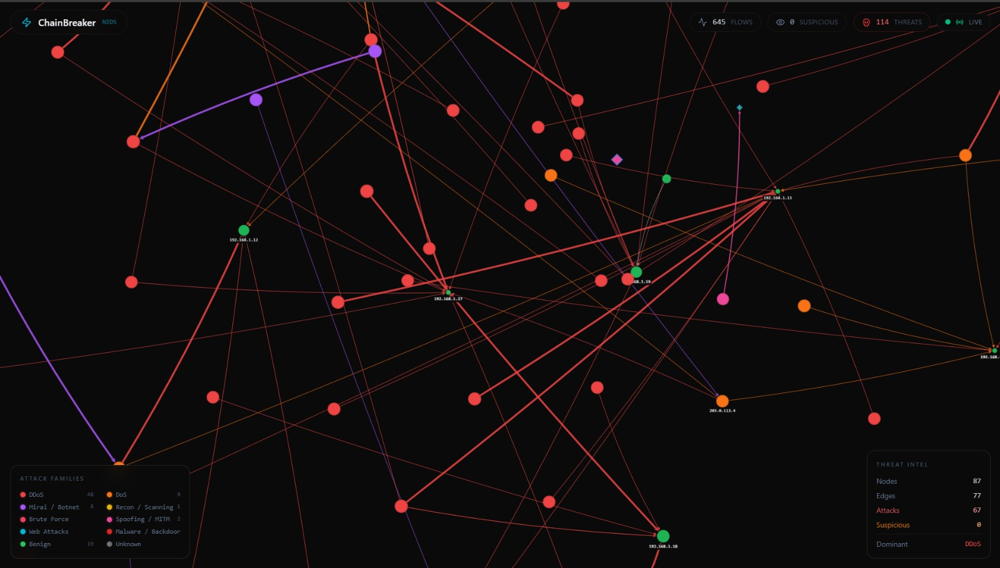
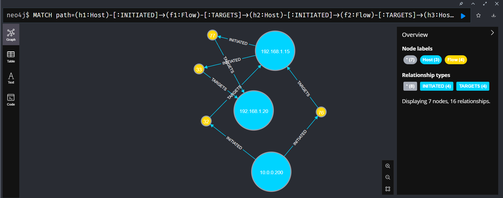
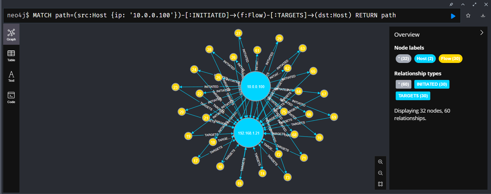
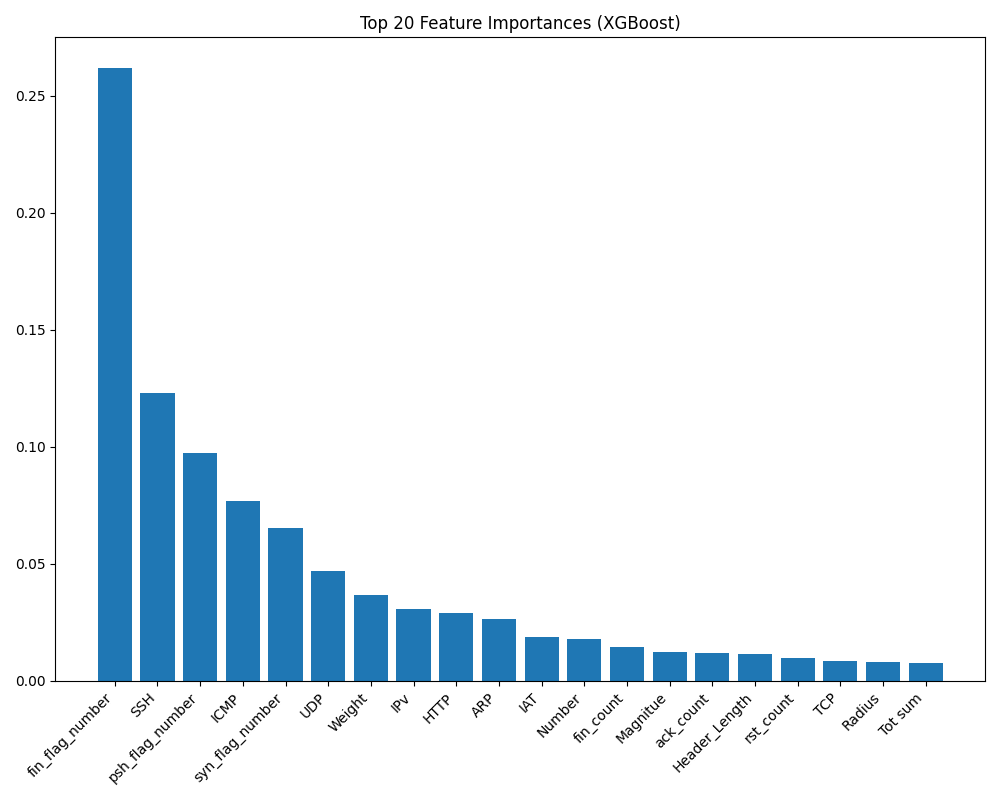
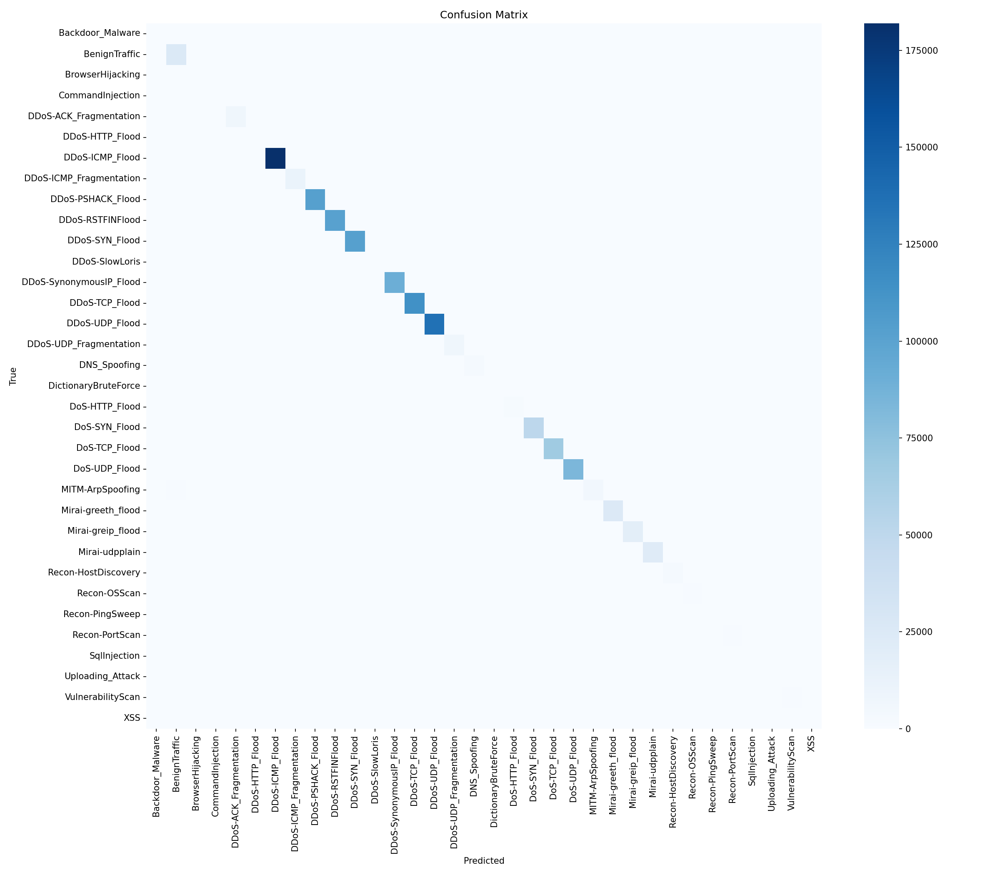
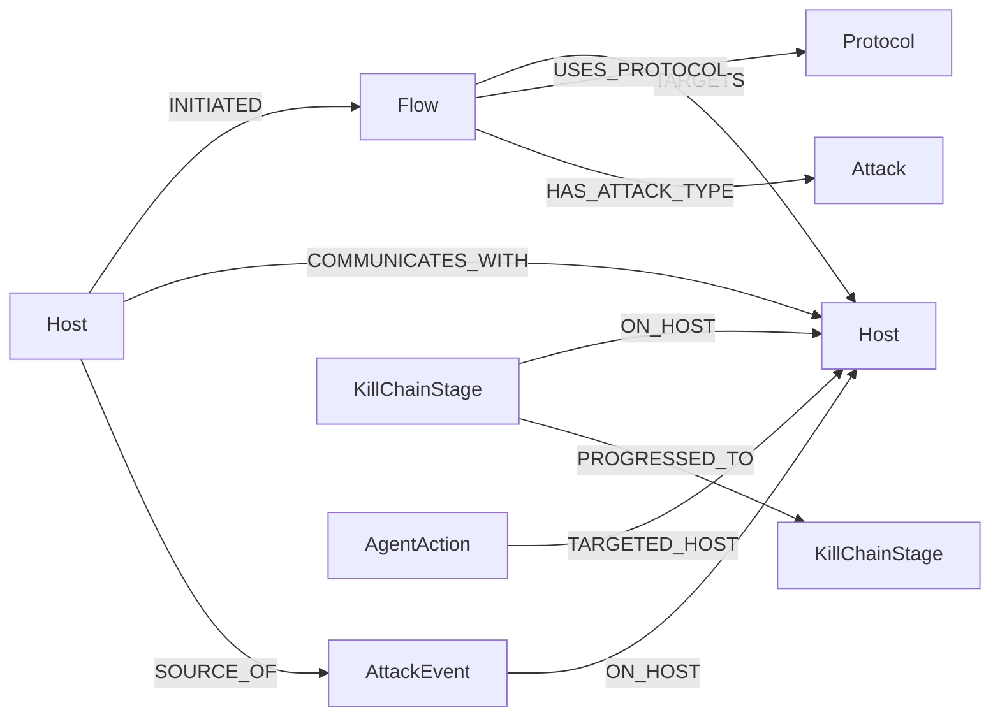
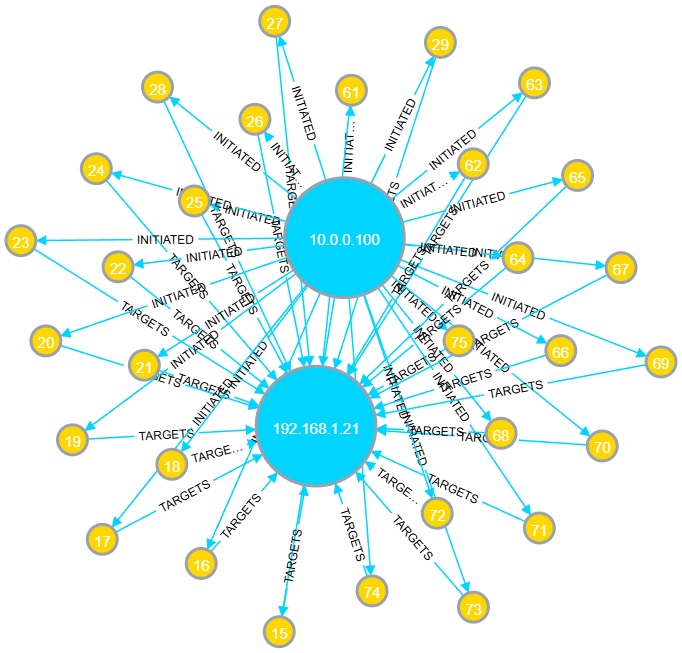

<div align="center">

# 🛡️ ChainBreaker

**Graph-Driven Cyber Incident Detection, Forensic Analysis & Kill Chain Interruption**

[](.)
[](.)
[](.)
[](.)
[](.)
[](.)

A real-time NIDS that models cyber telemetry as a persistent, queryable attack graph —<br>
enabling kill chain tracking, blast radius analysis, and forensic reconstruction across **34 attack categories**.

</div>

<p align="center">
  
</p>

<div align="center">
  <sub>Live SOC dashboard: ML-scored network topology · attack family classification · threat counters · WebSocket telemetry</sub>
</div>

<br>

## ⚡ Project Highlights

<table>
<tr>
<td width="50%">

- 🔴 **Real-time Kafka ingestion** — 500-flow batched streaming pipeline
- 🕸️ **Neo4j attack graph** — persistent, queryable flow-centric model
- 🤖 **34-class ML detection** — XGBoost + Isolation Forest (99.3% accuracy)
- 🔗 **Kill chain reconstruction** — MITRE ATT&CK stage mapping

</td>
<td width="50%">

- 💥 **Blast radius analysis** — graph traversal for compromise impact
- 📡 **Live WebSocket dashboard** — React + Cytoscape.js force-directed graph
- 🐳 **Docker Compose** — one-command Neo4j + Kafka + Backend + Frontend
- 🔬 **Forensic engine** — attack path tracing, timelines, automated reports

</td>
</tr>
</table>

### Neo4j Graph Visualizations

<p align="center">
<table>
<tr>
<td align="center" width="50%">
<br>
<sub><b>Attack Chain Traversal</b> — Multi-hop path between hosts</sub>
</td>
<td align="center" width="50%">
<br>
<sub><b>DDoS Fan-Out Cluster</b> — High fan-in from attacker to victim</sub>
</td>
</tr>
</table>
</p>

---

## 🏗️ Architecture

ChainBreaker implements a **streaming ML inference pipeline** that ingests network flows, classifies them across 34 attack categories, writes results to a Neo4j graph, and streams enriched telemetry to a React dashboard via WebSocket.

```
┌──────────────────────────────────────────────────────────────────────┐
│                    React Dashboard (Vite + Cytoscape.js)             │
│         Attack Graph │ Threat Intel │ ML Metrics │ Forensics         │
└───────────────────────────────┬──────────────────────────────────────┘
                                │ WebSocket + REST
┌───────────────────────────────▼──────────────────────────────────────┐
│                       FastAPI Backend (Uvicorn)                      │
│                                                                      │
│  ┌─────────────┐  ┌──────────────┐  ┌────────────┐  ┌────────────┐ │
│  │  ML Engine   │  │  Forensics   │  │   MITRE    │  │  Pipeline  │ │
│  │ XGB + IsoFor │  │ Blast Radius │  │  Aligner   │  │Orchestrator│ │
│  │ 34-class     │  │ Path Tracer  │  │  ATT&CK    │  │            │ │
│  └──────┬───────┘  │ Timeline     │  │  Mapper    │  └─────┬──────┘ │
│         │          │ Kill Chain   │  └────────────┘        │        │
│         │          │ Report Gen   │                        │        │
│         │          └──────────────┘                        │        │
└─────────┼─────────────────────────────────────────────────┼────────┘
          │                                                  │
    ┌─────▼──────────────────────────────────────────────────▼───────┐
    │              Neo4j 5.20 (Single Source of Truth)                │
    │  Host │ Flow │ AttackEvent │ KillChainStage │ Protocol │ Attack │
    └───────────────────────────────┬────────────────────────────────┘
                                    ▲
              ┌─────────────────────┴──────────────────────┐
              │           Kafka Ingestion Layer             │
              │  Topic: network-events │ Batch: 500 flows   │
              │  Consumer → Parser → ML Inference → Neo4j   │
              └─────────────────────────────────────────────┘
```

### Data Flow

1. **Ingestion** — Network flows arrive via Apache Kafka (`network-events` topic) or CSV batch processor
2. **Parsing** — `cicflow_parser` normalizes raw CICFlowMeter/CICIoT2023 rows, validates IPs
3. **ML Inference** — XGBoost (34-class) + Isolation Forest score each flow in vectorized batches
4. **Graph Writing** — Batched `UNWIND` Cypher writes Flows, Hosts, Protocols, Attacks, and edges to Neo4j
5. **Orchestration** — Pipeline orchestrator writes `AttackEvent` and `KillChainStage` nodes, updates host compromise status
6. **Streaming** — WebSocket broadcasts enriched telemetry to connected dashboard clients
7. **Forensics** — Graph traversals reconstruct attack paths, compute blast radius, build timelines

---

## 🚀 Quick Start

### Prerequisites

- Python 3.10+, Node.js 18+, Docker Desktop

### 1. Clone & Setup

```bash
git clone https://github.com/Kaushik-Kishor/chainbreaker.git
cd chainbreaker

python -m venv venv
venv\Scripts\activate        # Linux/Mac: source venv/bin/activate
pip install -r requirements.txt

cp .env.example .env         # Configure credentials
```

### 2. Start Infrastructure

```bash
# Launch Neo4j + Kafka + Zookeeper
docker compose -f docker/docker-compose.yml up -d
```

### 3. Initialize & Train

```bash
# Initialize Neo4j schema + seed hosts
python scripts/init_neo4j.py

# Train ML models (XGBoost + Isolation Forest on CICIoT2023)
python scripts/train_ml.py
```

### 4. Launch Application

```bash
# Terminal 1: Backend API
uvicorn backend.main:app --reload --port 8000

# Terminal 2: Frontend Dashboard
cd frontend && npm install && npm run dev
```

> **Dashboard**: http://localhost:5173 · **API Docs**: http://localhost:8000/docs · **Neo4j Browser**: http://localhost:7474

<details>
<summary><strong>🐳 Full Docker Deployment</strong></summary>

```bash
# One-command deployment (Neo4j + Kafka + Backend + Frontend)
docker compose -f docker/docker-compose.yml up -d

# Services:
#   Frontend  → http://localhost:5173
#   Backend   → http://localhost:8000
#   Neo4j     → http://localhost:7474 (bolt://localhost:7687)
#   Kafka     → localhost:9092
```

</details>

<details>
<summary><strong>⚙️ Environment Variables</strong></summary>

```env
NEO4J_URI=bolt://localhost:7687
NEO4J_USER=neo4j
NEO4J_PASSWORD=chainbreaker
KAFKA_BOOTSTRAP_SERVERS=localhost:9092
KAFKA_TOPIC=network-flows
MODEL_DIR=models
XGB_CONFIDENCE_THRESHOLD=0.5
API_HOST=0.0.0.0
API_PORT=8000
```

</details>

---

## 🤖 ML Detection Pipeline

ChainBreaker uses a **hybrid XGBoost + Isolation Forest** pipeline trained on the **CICIoT2023** dataset — achieving **99.3% accuracy** across **34 attack categories**.

### Model Architecture

| Component | Role | Details |
|-----------|------|---------|
| **XGBoost Classifier** | Multi-class attack classification | 500 trees, depth 7, `multi:softprob`, GPU-accelerated |
| **Isolation Forest** | Zero-day / novel anomaly detection | Trained on benign-only traffic, 5th-percentile threshold |
| **Confidence Calibrator** | Log-space probability rescaling | Maps 0.995–0.99999 → 60–100% visible range |
| **Label Encoder** | 34-class mapping | CICIoT2023 attack taxonomy |

### 34 Attack Categories

```
DDoS:  ACK_Fragmentation, HTTP_Flood, ICMP_Flood, ICMP_Fragmentation,
       PSHACK_Flood, RSTFINFlood, SYN_Flood, SlowLoris,
       SynonymousIP_Flood, TCP_Flood, UDP_Flood, UDP_Fragmentation
DoS:   HTTP_Flood, SYN_Flood, TCP_Flood, UDP_Flood
Recon: HostDiscovery, OSScan, PingSweep, PortScan
Mirai: greeth_flood, greip_flood, udpplain
Other: Backdoor_Malware, BrowserHijacking, CommandInjection,
       DNS_Spoofing, DictionaryBruteForce, MITM-ArpSpoofing,
       SqlInjection, Uploading_Attack, VulnerabilityScan, XSS
```

### Training Performance

| Metric | Value |
|--------|-------|
| Validation Accuracy | **99.34%** |
| Weighted F1-Score | **99.33%** |
| Macro F1-Score | **83.03%** |
| Total Features | 45 (flow metrics + TCP flags + protocol indicators + statistical) |
| Training Samples | 200,000 (stratified) |

### Feature Importance

<p align="center">
  
</p>

<details>
<summary><strong>View 34×34 Confusion Matrix</strong></summary>

<p align="center">
  
</p>

</details>

### Kill Chain Stage Mapping

ML predictions are mapped to MITRE ATT&CK kill chain stages for graph-level threat correlation:

| Attack Category | Kill Chain Stage | MITRE Tactic |
|----------------|-----------------|--------------|
| BruteForce, Mirai, Injection, XSS | Initial Access | TA0001 |
| Backdoor, Trojan | Persistence | TA0003 |
| PortScan, Recon, VulnerabilityScan | Discovery | TA0007 |
| CredentialTheft, PrivilegeEscalation | Credential Access | TA0006 |
| LateralMovement, SSH, SMB, RDP | Lateral Movement | TA0008 |
| C2, HTTP, DNS tunneling | Command & Control | TA0011 |
| Evasion | Defense Evasion | TA0005 |
| Ransomware, DataTheft | Exfiltration | TA0010 |
| DDoS, DoS | Denial of Service | — |

---

## 🕸️ Graph Analytics & Forensic Queries

### Neo4j Graph Schema


```mermaid
graph LR
    H1[Host] -->|INITIATED| F[Flow]
    F -->|TARGETS| H2[Host]
    F -->|USES_PROTOCOL| P[Protocol]
    F -->|HAS_ATTACK_TYPE| A[Attack]
    H1 -->|COMMUNICATES_WITH| H2
    AE[AttackEvent] -->|ON_HOST| H2
    H1 -->|SOURCE_OF| AE
    KC[KillChainStage] -->|ON_HOST| H2
    KC -->|PROGRESSED_TO| KC2[KillChainStage]
    AG[AgentAction] -->|TARGETED_HOST| H2
```

### Node Types

| Node | Key Properties | Description |
|------|---------------|-------------|
| **Host** | `ip`, `role`, `compromise_status`, `first_seen` | Network endpoints |
| **Flow** | `flow_id`, `label`, `predicted_label`, `confidence_score` | Individual network communications |
| **AttackEvent** | `event_id`, `stage`, `confidence`, `attack_label` | ML-detected attack instances |
| **KillChainStage** | `stage`, `status`, `dwell_time_seconds` | ATT&CK stage tracking per host |
| **Protocol** | `name` | TCP, UDP, ICMP, HTTP, SSH, etc. |
| **Attack** | `label`, `subLabel` | Attack type classification |

<p align="center">
  
</p>

### Forensic Cypher Queries

<details>
<summary><strong>🔍 Attack Path Reconstruction</strong></summary>

```cypher
// Trace multi-hop attack path from a compromised host
MATCH path = (start:Host {ip: '10.0.0.100'})-[:COMMUNICATES_WITH*1..5]->(end:Host)
WHERE any(h IN nodes(path) WHERE
  exists((e:AttackEvent)-[:ON_HOST]->(h)))
RETURN path
```

</details>

<details>
<summary><strong>💥 Blast Radius Analysis</strong></summary>

```cypher
// Identify all hosts reachable from a compromised node
MATCH (h:Host {compromise_status: 'compromised'})
OPTIONAL MATCH (h)-[:COMMUNICATES_WITH*1..3]->(neighbor:Host)
OPTIONAL MATCH (e:AttackEvent)-[:ON_HOST]->(h)
RETURN h.ip AS compromised_host,
       collect(DISTINCT neighbor.ip) AS reachable_hosts,
       count(DISTINCT e) AS attack_events
ORDER BY attack_events DESC
```

</details>

<details>
<summary><strong>⏱️ Kill Chain Timeline</strong></summary>

```cypher
// Reconstruct temporal kill chain progression
MATCH (k:KillChainStage)-[:ON_HOST]->(h:Host)
OPTIONAL MATCH (k)-[:PROGRESSED_TO]->(next:KillChainStage)
RETURN h.ip, k.stage, k.status, k.first_detected,
       k.dwell_time_seconds, next.stage AS progressed_to
ORDER BY k.first_detected
```

</details>

<details>
<summary><strong>📊 Top Attacked Hosts</strong></summary>

```cypher
MATCH (f:Flow)-[:TARGETS]->(h:Host)
WHERE f.label <> 'BenignTraffic'
WITH h, count(f) AS attack_count,
     collect(DISTINCT f.label) AS attack_types
RETURN h.ip AS victim, attack_count,
       attack_types, size(attack_types) AS unique_attacks
ORDER BY attack_count DESC LIMIT 10
```

</details>

<details>
<summary><strong>🌐 Communication Cluster Detection</strong></summary>

```cypher
MATCH (h1:Host)-[c:COMMUNICATES_WITH]->(h2:Host)
WHERE c.flow_count > 10
RETURN h1.ip, h2.ip, c.flow_count, c.suspicious
ORDER BY c.flow_count DESC LIMIT 50
```

</details>

---

## 🔗 API Reference

### Graph Endpoints

| Method | Endpoint | Description |
|--------|----------|-------------|
| `GET` | `/api/graph/hosts` | List all hosts with peer counts |
| `GET` | `/api/graph/hosts/{ip}` | Host detail with events, stages, actions |
| `GET` | `/api/graph/events` | Attack events (sorted by timestamp) |
| `GET` | `/api/graph/stages` | Active kill chain stages |
| `GET` | `/api/graph/edges` | Host-to-host communication edges |

### Forensics Endpoints

| Method | Endpoint | Description |
|--------|----------|-------------|
| `GET` | `/api/forensics/timeline` | Full attack timeline |
| `GET` | `/api/forensics/blast-radius` | Blast radius with severity scoring |
| `GET` | `/api/forensics/kill-chain-summary` | Kill chain stage summary |
| `GET` | `/api/forensics/attack-source/{ip}` | Trace attack origin |
| `GET` | `/api/forensics/report` | Generate forensic report |

### ML Endpoints

| Method | Endpoint | Description |
|--------|----------|-------------|
| `GET` | `/api/ml/status` | Model status, class count, accuracy |
| `GET` | `/api/ml/metrics` | Per-class precision/recall/F1 |
| `GET` | `/api/ml/classes` | List of 34 attack classes |
| `POST` | `/api/ml/predict` | Score a single flow |
| `POST` | `/api/ml/train` | Trigger model retraining |

### WebSocket

```
ws://localhost:8000/api/ws/telemetry
```

Streams real-time enriched telemetry events including ML scores, threat status, and graph topology updates.

---

## 🧠 Why Graph Databases?

Traditional SIEM/IDS systems store events as **flat rows** in relational tables. This breaks down for cyber telemetry because attacks are fundamentally **relational** — they involve chains of hosts, protocols, and temporal sequences that don't fit neatly into tables.

| Capability | Relational (SQL) | Graph (Neo4j) |
|-----------|------------------|---------------|
| **Lateral movement tracking** | Multi-table JOINs, O(n²) | Single traversal, O(depth) |
| **Attack path reconstruction** | Recursive CTEs, complex | `shortestPath()`, native |
| **Blast radius analysis** | Impractical at scale | Variable-length patterns |
| **Temporal correlation** | Window functions + JOINs | Ordered relationship traversal |
| **Kill chain progression** | Multiple lookup tables | `PROGRESSED_TO` edges |
| **Real-time topology** | Schema migrations | Dynamic node/edge creation |

**Why this matters:**
- **Attack Relationships** — DDoS fan-in is a natural graph pattern, not a table pattern
- **Traversal** — "Which hosts can attacker X reach within 3 hops?" is one Cypher query
- **Lateral Movement** — Internal pivot chains are first-class graph paths
- **Forensic Reconstruction** — Walking backward through attack chains is purpose-built for graphs

---

## 📂 Project Structure

```
chainbreaker/
├── backend/
│   ├── main.py                    # FastAPI application factory
│   ├── api/routes/
│   │   ├── graph.py               # Host, event, edge endpoints
│   │   ├── forensics.py           # Timeline, blast radius, reports
│   │   ├── ml.py                  # Model status, predict, train
│   │   ├── alerts.py              # Alert management
│   │   ├── agent.py               # RL agent endpoints
│   │   └── ws.py                  # WebSocket telemetry stream
│   ├── graph/
│   │   ├── neo4j_client.py        # Async Neo4j driver (singleton)
│   │   ├── flow_writer.py         # Batched UNWIND Cypher ingestion
│   │   ├── schema_manager.py      # Constraint/index initialization
│   │   ├── attack_writer.py       # AttackEvent node creation
│   │   ├── kill_chain_writer.py   # KillChainStage management
│   │   └── host_manager.py        # Host upsert operations
│   ├── ml/
│   │   ├── train.py               # XGBoost + IsoForest training
│   │   ├── inference.py           # NIDSPredictor (batch + single)
│   │   ├── model_manager.py       # Auto-train, validation, scoring
│   │   ├── features.py            # Feature definitions (45 cols)
│   │   └── evaluate.py            # Confusion matrix, per-class F1
│   ├── forensics/
│   │   ├── attack_path_tracer.py  # Multi-hop path reconstruction
│   │   ├── blast_radius.py        # Compromise impact analysis
│   │   ├── kill_chain_profiler.py # Stage progression profiling
│   │   ├── timeline_builder.py    # Temporal event reconstruction
│   │   └── report_generator.py    # Automated forensic reports
│   ├── ingestion/
│   │   ├── kafka_consumer.py      # Kafka → ML → Neo4j pipeline
│   │   ├── cicflow_parser.py      # CICFlowMeter row normalization
│   │   └── batch_collector.py     # CSV batch processing
│   ├── mitre/                     # ATT&CK stage/tactic mapping
│   ├── agent/                     # RL automated response (Phase 2)
│   ├── temporal/                  # PySpark windowed aggregation
│   └── pipeline/
│       └── orchestrator.py        # End-to-end flow processing
├── frontend/src/                  # React + TypeScript + Cytoscape.js
│   ├── components/
│   │   ├── GraphView.tsx          # Force-directed attack graph
│   │   ├── SidePanel.tsx          # Threat intel + ML metrics
│   │   └── TopBar.tsx             # Live flow/threat counters
│   └── graph/
│       └── cytoscapeConfig.ts     # Node styling + layout config
├── config/                        # kafka.yaml, ml.yaml, neo4j.yaml, rl.yaml
├── scripts/                       # init_neo4j.py, train_ml.py
├── docker/docker-compose.yml      # Full stack orchestration
├── models/                        # Trained artifacts (versioned)
├── data/                          # CICIoT2023 train/val/test splits
├── tests/                         # Unit tests
└── docs/                          # Architecture docs + screenshots
```

---

## 🛠️ Tech Stack

| Layer | Technology | Purpose |
|-------|-----------|---------|
| **Graph Database** | Neo4j 5.20 + APOC | Persistent attack graph, Cypher forensics |
| **Stream Processing** | Apache Kafka (Confluent 7.5) | Real-time flow ingestion |
| **ML Framework** | XGBoost 2.0 + scikit-learn | 34-class attack classification |
| **Anomaly Detection** | Isolation Forest | Zero-day/novel attack detection |
| **Backend API** | FastAPI + Uvicorn | Async REST + WebSocket |
| **Frontend** | React 18 + TypeScript + Cytoscape.js | Interactive attack graph |
| **Containerization** | Docker Compose | Multi-service orchestration |
| **RL Framework** | Stable-Baselines3 (MaskablePPO) | Automated response (Phase 2) |
| **Temporal Analytics** | PySpark | Windowed aggregation, spray detection |

---

## ⚡ Performance & Scale

| Metric | Value |
|--------|-------|
| Kafka batch size | 500 flows/batch |
| Neo4j batch write | Single `UNWIND` Cypher per batch |
| ML batch inference | Vectorized NumPy/XGBoost (no per-row loops) |
| WebSocket broadcast | Configurable interval (default 0.3s with jitter) |
| Confidence calibration | Log-space rescaling for high-confidence separation |
| Model auto-validation | Rejects single-class models, auto-retrains |
| Neo4j connection pool | 50 connections, 3600s lifetime |

---

## 🔮 Future Enhancements

### Phase 2: Reinforcement Learning Response Engine *(In Progress)*

- **MaskablePPO agent** with stage-conditioned action masking (8 actions × 8 kill chain stages)
- **Graph-topology observation vector** derived from live Neo4j metrics
- **Multi-objective reward**: early interruption (+10), blast radius reduction, dwell time penalty
- Actions: `block_ip`, `isolate_host`, `kill_process`, `reset_connection`, `block_port`, `quarantine_subnet`, `notify_admin`, `collect_forensics`

### Planned Roadmap

| Category | Enhancement |
|----------|------------|
| **Observability** | Grafana dashboards for pipeline metrics, Kafka lag, Neo4j query performance |
| **Kafka Monitoring** | Kafdrop / AKHQ / Kafka UI for topic inspection and consumer group management |
| **Graph ML** | Graph Neural Networks (GraphSAGE/GAT) for topology-aware anomaly detection |
| **Temporal Analytics** | Temporal graph analytics with time-windowed subgraph analysis |
| **Stream Processing** | Kafka → Spark Structured Streaming for sub-second detection |
| **SIEM Integration** | Splunk/Elastic SIEM connectors for enterprise deployment |
| **Threat Intel Feeds** | STIX/TAXII feed ingestion for IOC enrichment |
| **Container Orchestration** | Kubernetes deployment with Helm charts |
| **Alert Prioritization** | ML-ranked alert queue with severity scoring |
| **Real-time Visualization** | Live WebSocket-driven attack graph animation |

---

## 🏗️ Engineering Challenges

<details>
<summary><strong>High-Cardinality Multi-Class Classification</strong></summary>

The CICIoT2023 dataset has 34 attack classes with severe class imbalance (DDoS flows outnumber rare attacks like XSS by 1000:1). We use `compute_sample_weight("balanced")` instead of SMOTE to avoid synthetic sample artifacts, and train with `early_stopping_rounds=20` to prevent overfitting on majority classes.

</details>

<details>
<summary><strong>XGBoost Confidence Calibration</strong></summary>

XGBoost on well-separated datasets produces max-probabilities in a narrow band (0.995–0.99999), making naive probability display useless (always rounds to 100%). We implemented a **log-space rescaling** function: `-log10(1-p)` mapped linearly from [2.0, 5.0] → [60%, 100%], preserving monotonicity while making micro-differences visible.

</details>

<details>
<summary><strong>Deterministic Topology Synthesis</strong></summary>

The CICIoT2023 dataset lacks IP columns. The WebSocket replay engine synthesizes a realistic network topology using deterministic IP pools seeded by row index — maintaining persistent attacker/victim relationships, DDoS fan-out patterns, and lateral movement clusters across replays.

</details>

<details>
<summary><strong>Batched Graph Ingestion</strong></summary>

Per-flow Neo4j writes are prohibitively slow. The flow writer uses a single `UNWIND $batch` Cypher query that atomically creates/merges Hosts, Flows, Protocols, Attacks, and all relationships in one transaction — achieving orders-of-magnitude throughput improvement.

</details>

---

## 🧪 Testing

```bash
pytest tests/ -v                         # Full test suite
pytest tests/test_ml_pipeline.py -v      # ML training + inference
pytest tests/test_ingestion.py -v        # Flow parsing + ingestion
pytest tests/test_forensics.py -v        # Forensic engine
pytest tests/test_mitre_mapper.py -v     # MITRE ATT&CK mapping
```

---

## 👥 Team

Built by **Kaushik Kishor** — Backend Engineering · Data Engineering · Cybersecurity

---

<div align="center">

**ChainBreaker** — *Because cyber defense shouldn't be blind to the graph.*

[](https://github.com/Kaushik-Kishor)

</div>
